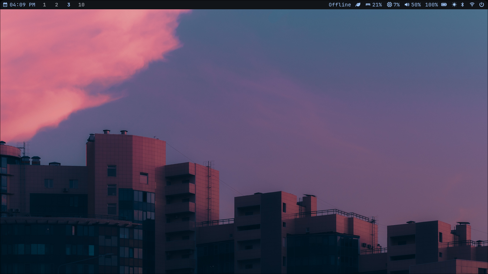
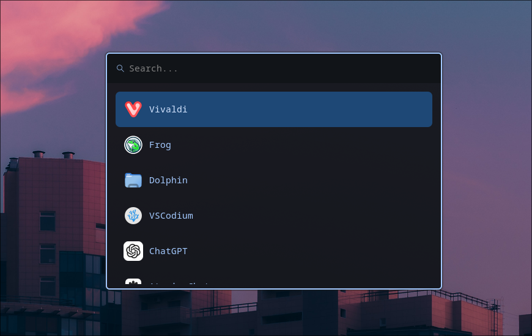
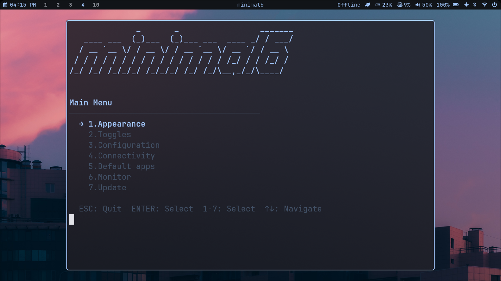
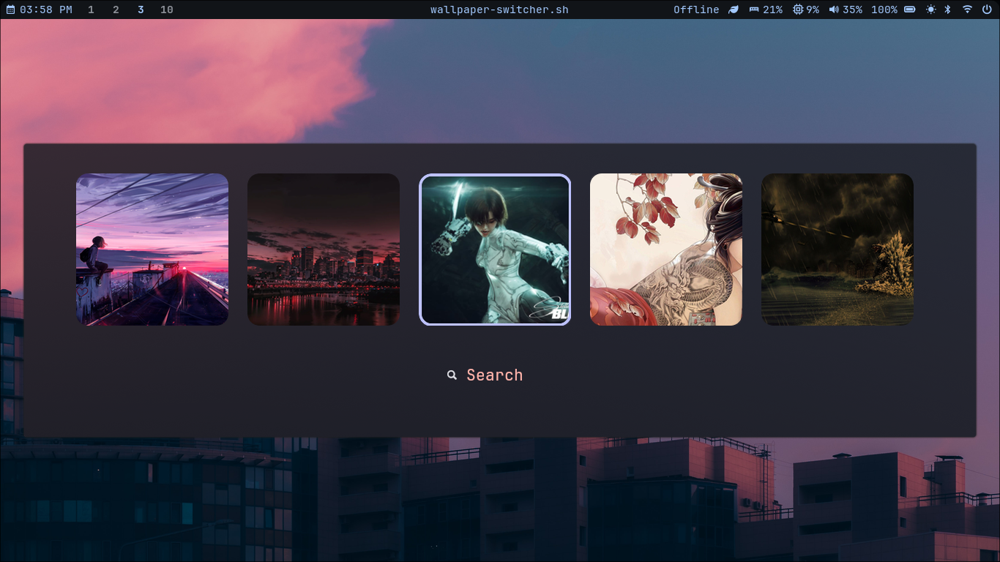
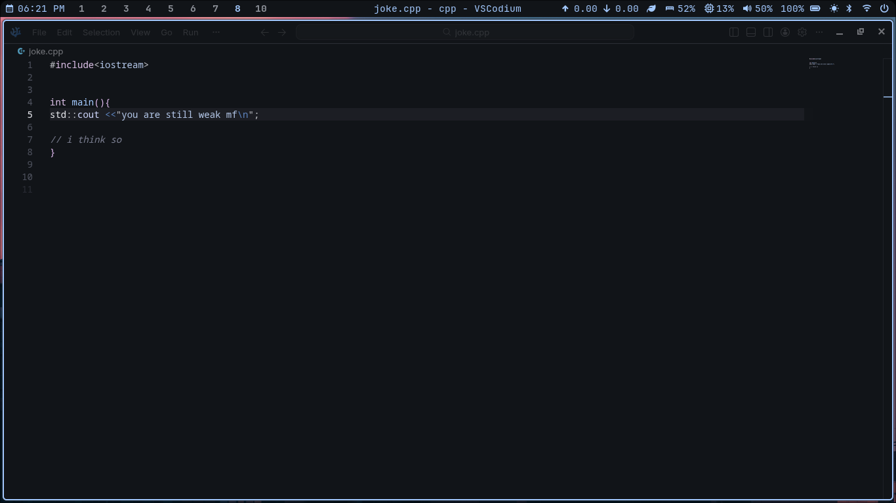
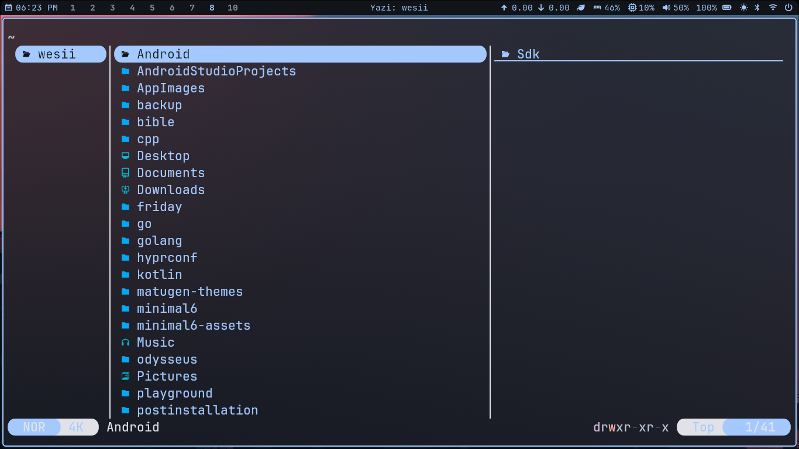

# minimal6

Minimal Hyprland dotfiles.

## ✨ Features

- Dynamic wallpaper-based theming
- Minimal6 Quick Settings
- wallpaper switcher
- GTK3, GTK4, Qt5, Qt6 & Kvantum support
- Waybar integration
- Wofi launcher 
- Dunst notifications
- Terminal theming
- Consistent desktop styling
- Automatic theme reload
- Fast installation

## Screenshots

<p align="center">
  
  
  
  
  
  

</p>


## Setup

```bash
git clone https://github.com/fallenwesii/minimal6.git
cd minimal6
chmod +x setup.sh && ./setup.sh
```

Installs packages (pacman + AUR), links configs, applies wallpaper and generates colors based on matugen .


## Uninstall

To undo the symlinks, scripts, and theme overrides set up by minimal6 (without uninstalling any applications):

```bash
./uninstall.sh
```

## Keybinds


 `Super + H`  to view all keybindings.   
 `Super + S` for Quick-settings
